# EdgePLC BL245说明书V1.1

前言

感谢您使用深圳市钡铼技术有限公司的BL245系列，阅读本产品说明书能让您快速掌握本产品的功能和使用方法。

版权声明

本说明书之所有权由深圳市钡铼技术有限公司所有。未经本公司之书面许可，任何单位和个人无权以任何形式复制、传播和转载本手册之任何部分，否则一切后果由违者自负。

免责声明

由于运营商升级网络造成设备无法继续使用的，本公司不能提供免费的升级服务。由于特殊原因造成运营商网络服务中断时，本机将无法正常工作，本公司不承担由此带来的后果。

本产品主要用于基于GPRS/网络的数据传输应用，请按照说明书提供的参数和技术规格使用，同时请注意无线电产品特别是GPRS产品使用时应该关注的注意事项，本公司不承担由于不正常使用或不恰当使用本产品造成的财产或人身伤害。

本产品包含开源软件或第三方组件。因开源软件的缺陷、漏洞、兼容性问题、停止维护或协议变更等原因导致的系统故障、数据丢失或安全问题，本公司概不负责。用户需自行承担使用开源组件的相关风险。

修订记录

| 更新日期 | 文档版本 | 说明 | 修订内容 | 作者 |
|---|---|---|---|---|
| 2026.4.24 | Ver.1.0 | 首次发布 |  | ZJX |
|  |  |  |  |  |

## 1.产品简介

### 1.1 概述

在工业自动化向“AI边缘计算+实时控制”深度融合的转型背景下，传统PLC面临智能计算的瓶颈，而通用工业计算机又难以满足高实时性控制的需求。EdgePLC BL245系列工业AI边缘控制器应运而生，旨在打破IT与OT的融合壁垒，提供真正意义上的“边缘AI控算一体”解决方案。

BL245系列采用“高性能ARM处理器 + 分布式I/O扩展”的架构，以瑞芯微RK3588J/RK3588为核心，集成6TOPS算力的专用NPU，支持四核Cortex-A76 + 四核Cortex-A55 + 三核Cortex-M0的异构计算，在保障毫秒级实时控制的同时，具备强大的本地AI推理与数据处理能力。

EdgePLC BL245工业AI边缘控制器深度融合实时控制、AI边缘智能、协议转换、远程运维与二次开发等功能，支持IEC 61131-3标准编程环境（OpenPLC/NexPLC/CODESYS）、IGH EtherCAT硬实时主站，并可扩展多达32块N系列分布式I/O模块，覆盖DI/DO/AI/AO/温度采集等多种信号类型。软件层面基于Ubuntu 20.04系统，集成Docker、Node-RED、Python/C++开发环境，以及YOLOv5/8+OpenCV等AI视觉工具栈，实现从数据采集、实时分析到智能决策的全流程闭环。

BL245系列工业AI边缘控制器专为智能产线控制、储能EMS、光伏逆变器管理、AGV机器人、机器视觉等“控制+计算”协同场景设计，通过将智能分析下沉至设备边缘，它不仅实现了控制逻辑的精准执行，更完成了数据价值的就地转化与智能决策，助力企业构建更敏捷、更智能、更高效的下一代工业控制系统，从容应对智能制造的未来挑战。

### 1.2外形尺寸

产品外观结构与尺寸如下图：

### 1.3技术参数

| 分类 | 参数 | 描述 |
|---|---|---|
| 系统 | 处理器型号 | 瑞芯微 RK3588J/RK3588，64bit，8nm |
| 系统 | 处理器频率 | 4x ARM Cortex-A76 RK3588J 主频：normal mode 1.6GHz，overdrive mode 2.0GHz RK3588 主频：2.4GHz |
| 系统 | GPU | GPU：Mali-G610 MP4，支持 OpenGL ES 1.1/2.0/3.2、OpenCL 2.2、Vulkan 1.2 |
| 系统 | GPU | ISP:2x ISP(ISP0/ISP1)，支持HDR、3DNR，支持如下输入： 48M:8064x6048@15fps dual ISP 32M:6528x4898@30fps dual ISP 16M:4672x3504@30fps single ISP |
| 系统 | GPU | Decoder:支持8k@60fps H.265、8K@30fps H.264 Encoder:支持8K@30fps H.265/H2.64 |
| 系统 | NPU | 6TOPS 支持INT4/INT8/INT16/BF16/TF32 支持TensorFlow/PyTorch/Caffe/MXNet深度学习框架 |
| 系统 | 内存 | 4/8/16GByte LPDDR4X |
| 系统 | 存储 | 32/64/128GByte eMMC |
| 电源 | 输入电压 | DC 12～24V |
| 电源 | 功耗 | 正常：312mA@12V（带4G模块），252mA@12V（不带4G模块） 最大：700mA@12V |
| 电源 | 反接防护 | 支持 |
| 网口 | 网口规格 | RJ-45 接口，2~3个，2个10/100/1000M、1个10/100M 自适应网口 |
| 网口 | 网口保护 | ESD ±6kV（接触），±8kV（空气）； |
| SIM卡 | 数量 | 1 |
| SIM卡 | 规格 | 抽屉式接口 |
| 串口（选配） | 串口数量 | 2RS485 |
| 串口（选配） | 串口波特率 | 300bps-115200bps |
| 串口（选配） | 数据位 | 7,8 |
| 串口（选配） | 校验位 | None, Even, Odd |
| 串口（选配） | 停止位 | 1, 1.5,2 |
| N板数字输入（选配） | 数量 | 16/32通道 |
| N板数字输入（选配） | 输入类型 | 支持干接点或湿接点 |
| N板数字输入（选配） | 干接点 | 闭合：短接 断开：端开路 |
| N板数字输入（选配） | 湿接点 | 逻辑0：0-VDC 逻辑1：-24VDC |
| N板数字输入（选配） | 隔离保护 | 2KVrms |
| N板数字输出（选配） | 数量 | 16/32通道 |
| N板数字输出（选配） | 输出类型 | SINK |
| N板数字输出（选配） | 输出容量 | 单路100mA |
| USB接口 | 数量 | 1*micro USB，2*USB 3.0 HOST |
| SD卡座 | 数量 | 1 |
| SD卡座 | 规格 | 支持SD、SDHC和SDXC（UHS-I）卡 |
| HDMI接口 | 数量 | 1 |
| 天线 | 天线接口数量 | 1*Wi-Fi/移动网天线，1*GPS天线 |
| 天线 | 天线接口类型 | SMA孔式 |
| 4G模块(选配功能) | L-E版本 | GSM/EDGE:900,1800MHz WCDMA:B1,B5,B8 FDD-LTE:B1,B3,B5,B7,B8,B20 TDD-LTE:B38,B40,B41 |
| 4G模块(选配功能) | L-CE版本 | GSM/EDGE:900,1800MHz WCDMA:B1,B8 TD-SCDMA:B34,B39 FDD-LTE:B1,B3,B8 TDD-LTE:B38,B39,B40,B41 |
| 4G模块(选配功能) | L-A版本 | WCDMA:B2,B4,B5 FDD-LTE:B2,B4,B12 |
| 4G模块(选配功能) | L-AU版本 | GSM/EDGE:850,900,1800MHz WCDMA:B1,B2,B5,B8 FDD-LTE:B1,B3,B4,B5,B7,B8,B28 TDD-LTE:B40 |
| 4G模块(选配功能) | L-AF版本 | WCDMA:B2,B4,B5 FDD-LTE:B2,B4,B5,B12,B13,B14,B66,B71 |
| 4G模块(选配功能) | CAT-1版本 | GSM:900,1800 FDD-LTE:B1,B3,B5,B8 TDD-LTE:B34,B38,B39,B40,B41 |
| 5G模块(选配功能) | redcap版本 | 5G NR：N1/N3/N5/N8/N28/N41/N78/N79 LTE-FDD：B1/B3/B5/B8 LTE-TD：B34/B38/B39/B40/B41 |
| 5G模块(选配功能) | N-CN版本 | NR：N1/28/41/78/79 LTE：FDD B1/3/5/8 LTE：TDD B34/38/39/40/41 WCDMA：B1/8 |
| Wi-Fi(选配功能) | 接口 | PCIE |
| Wi-Fi(选配功能) | 协议 | IEEE 802.11b/g/n |
| Wi-Fi(选配功能) | 模式 | STA，AP |
| Wi-Fi(选配功能) | 频段 | 2.4GHz |
| Wi-Fi(选配功能) | 通道数 | Ch1 ~ Ch13 |
| Wi-Fi(选配功能) | 安全性 | Open、WPA、WPA2 |
| Wi-Fi(选配功能) | 加密 | AES、TKIP、TKIPAES |
| Wi-Fi(选配功能) | 连接数 | 8（Max） |
| Wi-Fi(选配功能) | 速率 | 150Mbps（Max） |
| Wi-Fi(选配功能) | SSID广播开关 | 支持 |
| 指示灯 | 数量 | LED*3（含两个可编程LED） |
| 环境 | 工作温度、湿度 | -40～85℃/0~70℃，5～95% RH |
| 环境 | 存储温度、湿度 | -40～85℃，5～95% RH |
| 其他 | 外壳 | 铝合金外壳+不锈钢 |
| 其他 | 尺寸 | 110*92*38mm |
| 其他 | 防护等级 | IP30 |
| 其他 | 安装方式 | DIN35导轨安装 |
| 其他 | 系统 | Buildroot-2021.11(Linux-5.10.209、Linux-RT-5.10.209) Ubuntu 20.04(Linux-5.10.209、Linux-RT-5.10.209) |

### 1.4设备选型

#### 1.4.1主型号选型

| 型号 | ETH | USB | HDMI | N板IO槽 | 尺寸 |
|---|---|---|---|---|---|
| BL245 |  | 2 | 0 | 1 | 38x92x110mm |
| BL245A |  | 2 | 1 | 1 | 38x92x110mm |

BL245系列选型

#### 1.4.2 SOM选型表

可以根据需求，选择合适的ROM、RAM以及温度等级。

BL245系列SOM选型表

| 型号 | MCU | 主频 | NPU | eMMC | LPDDR4X | 温度级别 |
|---|---|---|---|---|---|---|
| SOM450 | RK3588J | 2.0GHz | 6TOPS | 32GByte | 4GByte | 工业级 -40~85℃ |
| SOM451 | RK3588J | 2.0GHz | 6TOPS | 64GByte | 8GByte | 工业级 -40~85℃ |
| SOM452 | RK3588J | 2.0GHz | 6TOPS | 128GByte | 16GByte | 工业级 -40~85℃ |
| SOM453 | RK3588 | 2.4GHz | 6TOPS | 64GByte | 4GByte | 商业级 0~80℃ |
| SOM454 | RK3588 | 2.4GHz | 6TOPS | 64GByte | 8GByte | 商业级 0~80℃ |

#### 1.4.3 X系列板选型

可以根据需求，选择合适的X系列IO板，X系列IO板的PIN数要与外壳适配。

注意：本设备默认端口为RS485，如需RS232请向销售说明。

| X系列IO板选型表 | X系列IO板选型表 | X系列IO板选型表 | X系列IO板选型表 | X系列IO板选型表 | X系列IO板选型表 | X系列IO板选型表 |  |  |
|---|---|---|---|---|---|---|---|---|
| 型号 | RS232/RS485 | CAN | DI | DO | GPIO | GND | PIN数 | 备注 |
| X90 | 2 | × | × | × | × | 2 | 6PIN |  |
| X91 | 1 | 1 | × | × | × | 2 | 6PIN | BL245不支持 |

#### 1.4.4 N系列IO板选型

|  |  |  |  |  |
|---|---|---|---|---|
|  |  |  |  |  |
|  |  |  |  |  |
|  |  |  |  |  |
|  |  |  |  |  |
|  |  |  |  |  |
|  |  |  |  |  |
|  |  |  |  |  |
|  |  |  |  |  |
|  |  |  |  |  |
|  |  |  |  |  |
|  |  |  |  |  |
|  |  |  |  |  |
|  |  |  |  |  |

### 硬件说明

### 2.1 N板介绍

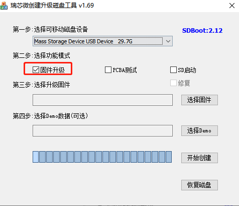
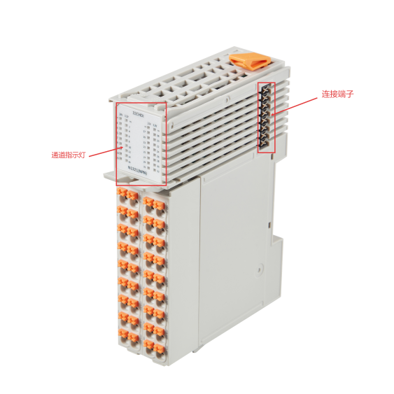

工业自动化控制系统中常见的分布式I/O模块，例如：右侧具体为32通道数字量输入模块，型号为N1321(NPN)。这类模块通常用于连接现场的传感器、按钮、限位开关等设备，将物理信号转换为PLC（可编程逻辑控制器）可识别的数字信号。

型号“N1321(NPN)”指明了其电气特性：NPN型输入，适用于漏型（Sink）输入电路，常用于连接NPN型传感器。

模块顶部有一个橙色的卡扣，用于将模块固定在DIN导轨上，便于安装和拆卸。

接线端子

模块底部排列着多组橙色的弹簧式接线端子，用于连接外部设备的信号线。

这些端子按通道编号（1-32）排列，方便用户快速接线和维护。

弹簧式端子设计使得接线无需工具，操作便捷，且连接可靠。

连接端子

模块化I/O系统内部通信和供电的背板总线连接器，它通常由一排精密的金属插针和插座组成，负责在相邻模块之间传递电源、数据和控制信号。

散热与结构设计

模块外壳采用白色工程塑料，表面有散热格栅设计，有助于在高密度安装或高温环境下散热。

整体结构紧凑，符合工业标准尺寸，可与其他模块组合使用，形成分布式I/O系统。

应用场景与优势

分布式控制：该模块通常与主PLC控制器通过现场总线（如EtherCAT、PROFINET等）连接，实现远程I/O扩展，减少布线成本，提高系统灵活性。

高密度输入：32通道的设计使其适用于需要大量输入点的场合，如大型生产线、自动化仓储系统等。

NPN输入特性：适用于连接NPN型传感器，这类传感器在工业现场应用广泛，具有抗干扰能力强、成本较低等优点。

### 2.2电源接口

。

设备提供1路输入。支持DC12~24V输入，支持反接防护

### 2.3模块端口说明

根据不同的X/N板，有不同的串口可选择。目前可选板型如下。

#### 2.3.1RS232/485模块

| X90模块（） | X90模块（） | X90模块（） | X90模块（） | X90模块（） | X90模块（） | X90模块（） |
|---|---|---|---|---|---|---|
| 端口号 | 1 | 2 | 3 | 4 | 5 | 6 |
| 名称 | ttyS3-A | ttyS3-B | GND | ttyS9-A | ttyS9-B | GND |

#### 2.3.2 DI模块

|  |  |  |  |  |  |  |  |  |  |
|---|---|---|---|---|---|---|---|---|---|
|  |  |  |  |  |  |  |  |  |  |
|  |  |  |  |  |  |  |  |  |  |
|  |  |  |  |  |  |  |  |  |  |
|  |  |  |  |  |  |  |  |  |  |

|  |  |  |  |  |  |  |  |  |  |
|---|---|---|---|---|---|---|---|---|---|
|  |  |  |  |  |  |  |  |  |  |
|  |  |  |  |  |  |  |  |  |  |
|  |  |  |  |  |  |  |  |  |  |
|  |  |  |  |  |  |  |  |  |  |
|  |  |  |  |  |  |  |  |  |  |
|  |  |  |  |  |  |  |  |  |  |
|  |  |  |  |  |  |  |  |  |  |
|  |  |  |  |  |  |  |  |  |  |

#### 2.3.3 DO模块

|  |  |  |  |  |  |  |  |  |  |
|---|---|---|---|---|---|---|---|---|---|
|  |  |  |  |  |  |  |  |  |  |
|  |  |  |  |  |  |  |  |  |  |
|  |  |  |  |  |  |  |  |  |  |
|  |  |  |  |  |  |  |  |  |  |

|  |  |  |  |  |  |  |  |  |  |
|---|---|---|---|---|---|---|---|---|---|
|  |  |  |  |  |  |  |  |  |  |
|  |  |  |  |  |  |  |  |  |  |
|  |  |  |  |  |  |  |  |  |  |
|  |  |  |  |  |  |  |  |  |  |

|  |  |  |  |  |  |  |  |  |  |
|---|---|---|---|---|---|---|---|---|---|
|  |  |  |  |  |  |  |  |  |  |
|  |  |  |  |  |  |  |  |  |  |
|  |  |  |  |  |  |  |  |  |  |
|  |  |  |  |  |  |  |  |  |  |
|  |  |  |  |  |  |  |  |  |  |
|  |  |  |  |  |  |  |  |  |  |
|  |  |  |  |  |  |  |  |  |  |
|  |  |  |  |  |  |  |  |  |  |

|  |  |  |  |  |  |  |  |  |  |
|---|---|---|---|---|---|---|---|---|---|
|  |  |  |  |  |  |  |  |  |  |
|  |  |  |  |  |  |  |  |  |  |
|  |  |  |  |  |  |  |  |  |  |
|  |  |  |  |  |  |  |  |  |  |
|  |  |  |  |  |  |  |  |  |  |
|  |  |  |  |  |  |  |  |  |  |
|  |  |  |  |  |  |  |  |  |  |
|  |  |  |  |  |  |  |  |  |  |

|  |  |  |  |  |  |  |  |  |  |  |  |  |  |
|---|---|---|---|---|---|---|---|---|---|---|---|---|---|
|  |  |  |  |  |  |  |  |  |  |  |  |  |  |
|  |  |  |  |  |  |  |  |  |  |  |  |  |  |
|  |  |  |  |  |  |  |  |  |  |  |  |  |  |
|  |  |  |  |  |  |  |  |  |  |  |  |  |  |

#### 2.3.4 AO模块

|  |  |  |  |  |  |  |  |  |  |
|---|---|---|---|---|---|---|---|---|---|
|  |  |  |  |  |  |  |  |  |  |
|  |  |  |  |  |  |  |  |  |  |
|  |  |  |  |  |  |  |  |  |  |
|  |  |  |  |  |  |  |  |  |  |

|  |  |  |  |  |  |  |  |  |  |
|---|---|---|---|---|---|---|---|---|---|
|  |  |  |  |  |  |  |  |  |  |
|  |  |  |  |  |  |  |  |  |  |
|  |  |  |  |  |  |  |  |  |  |
|  |  |  |  |  |  |  |  |  |  |

#### 2.3.5 AI模块

|  |  |  |  |  |  |  |  |  |  |
|---|---|---|---|---|---|---|---|---|---|
|  |  |  |  |  |  |  |  |  |  |
|  |  |  |  |  |  |  |  |  |  |
|  |  |  |  |  |  |  |  |  |  |
|  |  |  |  |  |  |  |  |  |  |

|  |  |  |  |  |  |
|---|---|---|---|---|---|
|  |  |  |  |  |  |
|  |  |  |  |  |  |
|  |  |  |  |  |  |
|  |  |  |  |  |  |

#### 2.3.6 RTD模块

|  |  |  |  |  |  |  |  |  |  |
|---|---|---|---|---|---|---|---|---|---|
|  |  |  |  |  |  |  |  |  |  |
|  |  |  |  |  |  |  |  |  |  |
|  |  |  |  |  |  |  |  |  |  |
|  |  |  |  |  |  |  |  |  |  |

#### 2.3.7 TC模块

|  |  |  |  |  |  |  |  |  |  |
|---|---|---|---|---|---|---|---|---|---|
|  |  |  |  |  |  |  |  |  |  |
|  |  |  |  |  |  |  |  |  |  |
|  |  |  |  |  |  |  |  |  |  |
|  |  |  |  |  |  |  |  |  |  |

|  |  |  |  |  |  |  |  |  |  |
|---|---|---|---|---|---|---|---|---|---|
|  |  |  |  |  |  |  |  |  |  |
|  |  |  |  |  |  |  |  |  |  |
|  |  |  |  |  |  |  |  |  |  |
|  |  |  |  |  |  |  |  |  |  |

### 2.3. RS485使用

以X90为例，6PIN端口：

RS232/485传输

使用RS232/485串口时，将RS232/485线接至端口上（ttl转485），打开sscom5和mobaxterm对接收发，如RS485-1端口（x90模块），其设备文件为/dev/ttyS3；设置其波特率设为 115200，8N1，无校验位。

stty -F /dev/ttyS3 ispeed 115200 ospeed 115200 cs8

echo 12345 > /dev/ttyS3 //通过RS485-1端口发送数据

cat /dev/ttyS3 //等待查看接收到的数据

串口助手收到数据

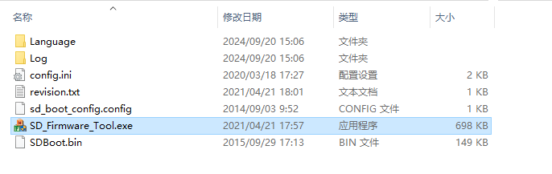

串口助手发送数据

终端界面收到数据

按“Ctrl+C”停止。

然后更换x90另外一个ttyS9口继续测试。

### 2.3. N板端口使用

软件安装

对应文件位置位于目录文件夹下,实际请以文件为准。

插上网线写入ifconfig指令获取IP，通过SSH登录

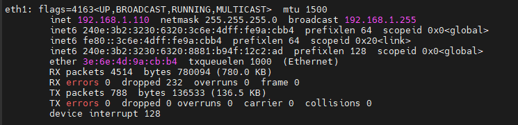

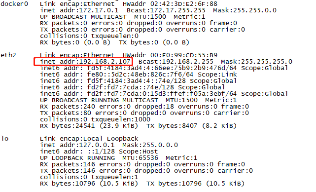
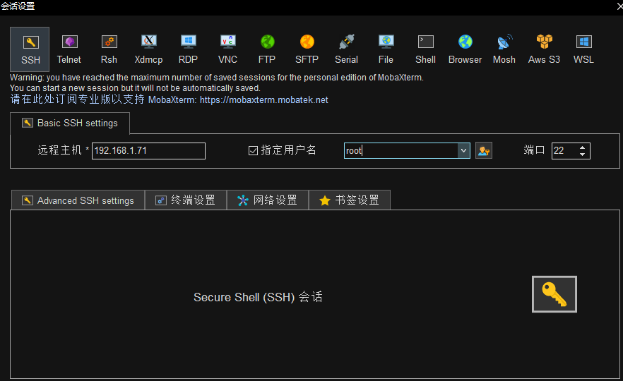

通过左边文件夹页面在文件夹下，把N板识别文件复制进去

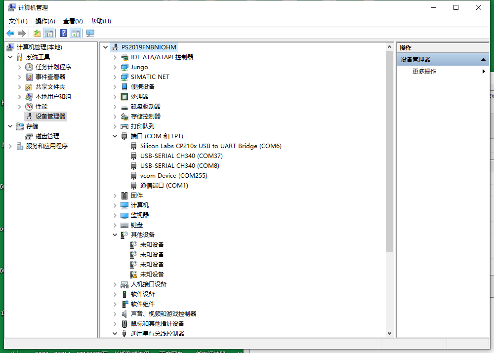
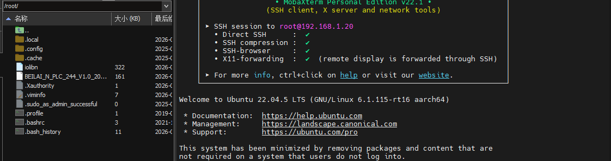

对.bin执行chmod +x .bin。然后安装软件。

root@bliiot:/# chmod +x .bin

root@bliiot:/# ./.bin

Md5 verify pass!

Created symlink /etc/systemd/system/multi-user.target.wants/iolib.service → /etc/systemd/system/iolib.service.

Install complete!

端口使用

DO使用

这里以N2为准（路DO模块），ion show查看IO板信息。ion help查看命令帮助。

root@bliiot:/# ion help

输入ion show查看信息。

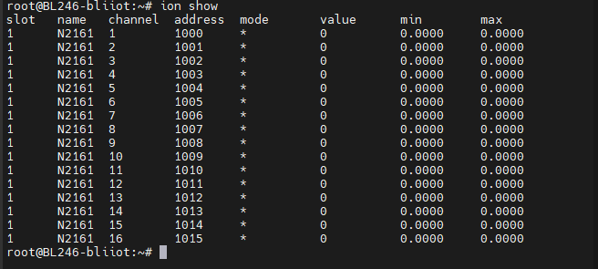

也可通过get命令获取通道值：

root@bliiot:/# ion get 1014 //通过address查看

address 1014 value 0

root@bliiot:/# ion set 1000 10 //通过address设置输出10

root@bliiot:/# ion get 1000 //通过address查看

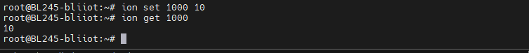
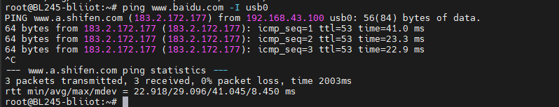

设置通道值有信号量会亮灯

对应的N2321、N类似。

DI使用

以N1为例（路DI模块湿节点），DI模块为例，输入ion show查看信息。

湿节点测试(带电干结点)：以N11为例（型）

## 1、外接电源：将外接电源的正负极接到电源两端，以通道为例，电源的接到模块的公共端（COM/0V），接到模块的 DI 输入端子。

## 2、灯亮，终端输入ion show查看已闭合。

型则公共端接，输入端子接。

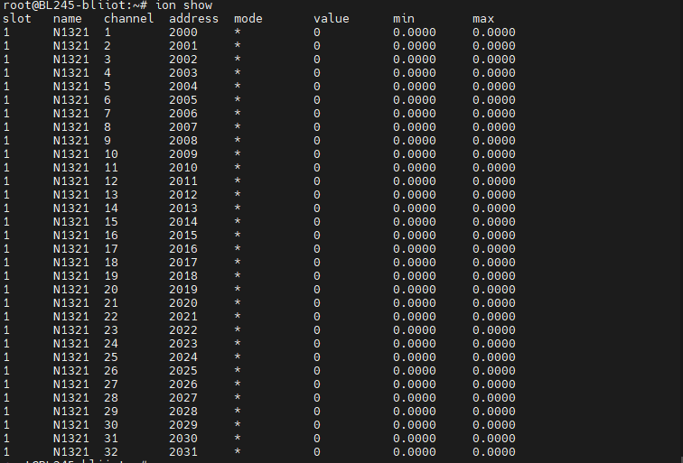

通过get命令获取通道值以及ion show查看信息

root@bliiot:/# ion get 20 //通过address查看

address 20 value 0

将DI（即为通道）短接

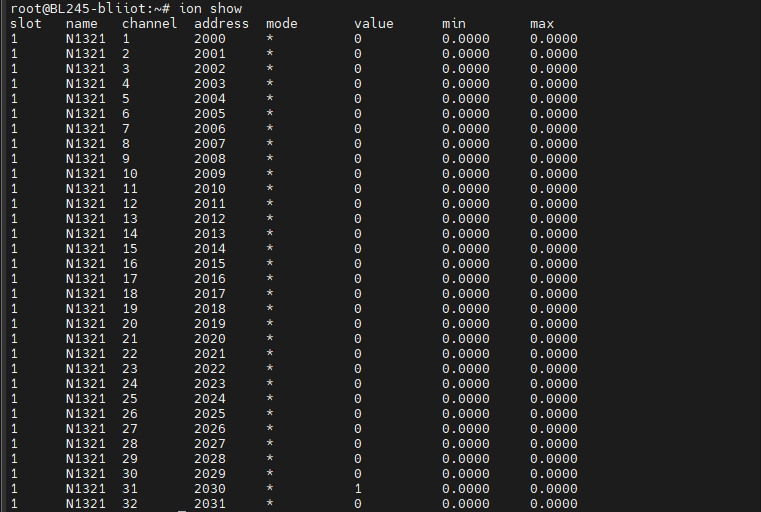

观察N板灯亮情况，对应DI短接形成回路灯亮。

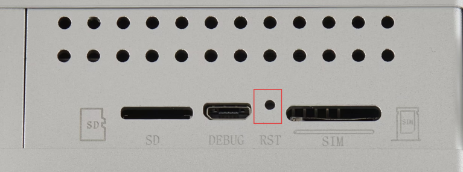

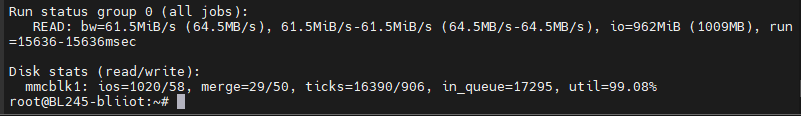

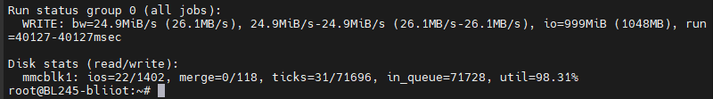

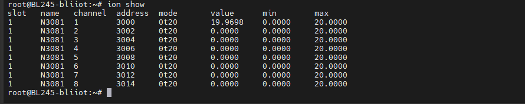
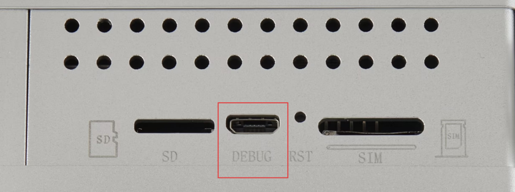

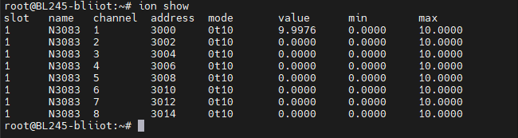

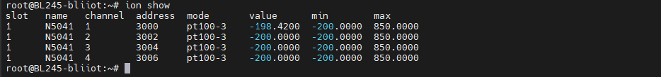

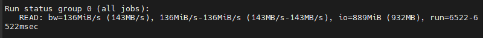

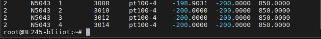

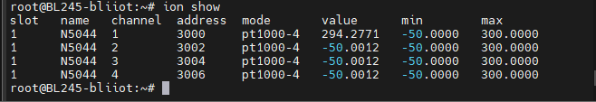

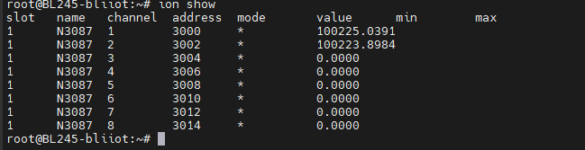

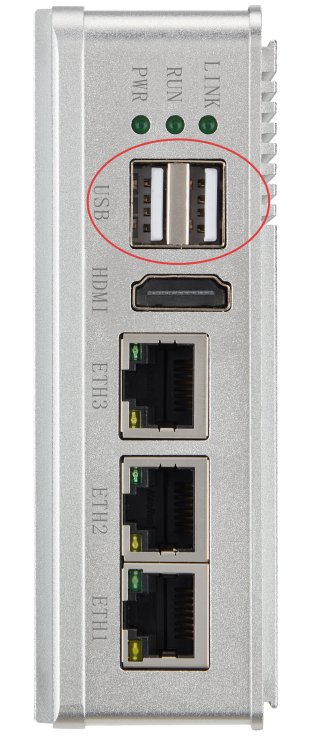

### 2.4 LED

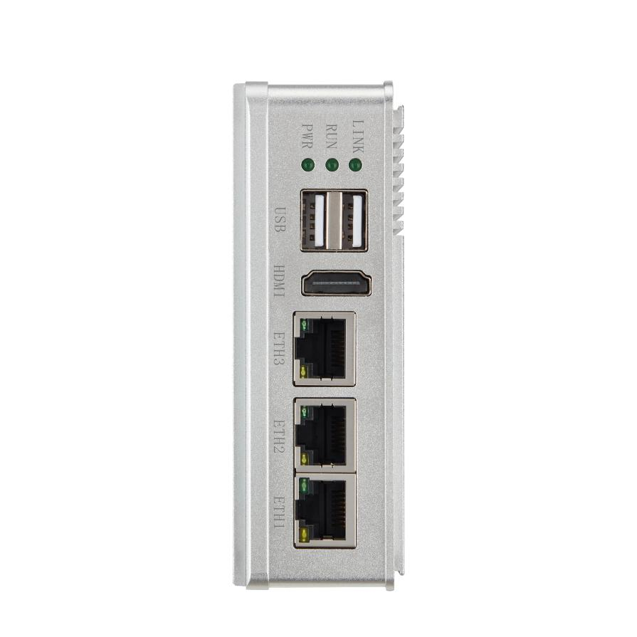

LED指示灯如图,从左至右的顺序为LED2、LED1、LED0。其中LED2为POWER指示灯，上电后电源正常时常亮；LED1为RUN灯，系统正常运行时闪烁；LED0为LINK灯，使用有线网络连接互联网时常亮，4G或Wi-Fi时闪烁。文件为/etc/beilai_led.sh。

查看触发条件：cat /sys/class/leds/user-led0/trigger

root@bliiot:~# cat /sys/class/leds/user-led0/trigger

[none] rc-feedback mmc0 mmc1 mmc2 timer oneshot heartbeat backlight gpio cpu0 cpu1 cpu2 cpu3 default-on transient

其中[none]表示当前led0的触发条件为无。往trigger中写上述字符串，可以修改触发条件。

当led触发条件设置为none时，用户可通过命令来控制led灯的亮灭

控制led0亮：echo 1 >/sys/class/leds/user-led0/brightness

root@bliiot:~# echo none >/sys/class/leds/user-led0/brightness

root@bliiot:~# echo 1 >/sys/class/leds/user-led0/brightness

控制led1灭：echo 0 >/sys/class/leds/user-led1/brightness

## 2.网络接口

如图所示，设备配备了两个千兆网口ETH1、ETH2，一个百兆网口ETH3

将网线插入ETH2，输入命令：

root@BL245:~# ifconfig -a

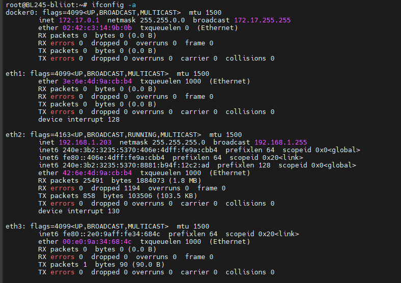

此时ETH2应显示为设定的静态IP地址192.168.1.203。

更换网口测试时关闭其他网口：

关闭网口1：ifconfig eth1 down

关闭网口3：ifconfig eth3 down

ping百度：ping 8.8.8.8 ，Ctrl+c结束

此时LINK灯亮。

## 2. USB接口

如图，设备带有2个USB3.0 HOST接口。支持FAT32格式U盘。

接入测试用的U盘，这边run/media/sda为挂载文件夹，输入以下指令卸载并查看U盘是否可以检测：

lsblk（查看是否挂载） mkfs.vfat /dev/sda1(格式化分区更好测速)

umount /run/media/sda1（没有挂载就跳过）

lsblk

可以看到sdb1，并且能够看到实际的内存大小

安装fio工具

apt update

apt install fio -y //有就跳过，出厂一般自带

然后输入以下指令测试写入：（第一次写入可以调成size=2G）

fio -filename=/dev/sda1 -ioengine=psync -iodepth=1 -iodepth_batch=1 -iodepth_low=1 -iodepth_batch_complete=1 -direct=1 -rw=write -bs=1024K -size=1G -numjobs=1 -thread -group_reporting -name=write_job -ramp_time=1

可以看到写入的速度。

再输入以下指令测试读取：

fio -filename=/dev/sda1 -ioengine=psync -iodepth=1 -iodepth_batch=1 -iodepth_low=1 -iodepth_batch_complete=1 -direct=1 -rw=read -bs=1024K -size=1G -numjobs=1 -thread -group_reporting -name=write_job -ramp_time=1

可以看到读取的速度。

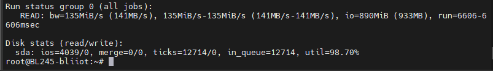

说明这个USB接口没有问题。

更换下一个USB口，需要执行

ps aux | grep fio //检查是否有残留进程，必要时用 kill 命令终止，然后再对进程同步sync

重复B~F操作，没有问题说明USB端口正常。

## 2. HDMI接口

HDMI接口如图所示。支持HDMI 1.4和HDMI 2.0标准。系统默认支持的分辨率为1920x1080@60fps，最高支持HDMI显示分辨率为 4K。

将HDMI连接设备和显示器，此时显示器应显示桌面系统。若没有显示可尝试重启设备。

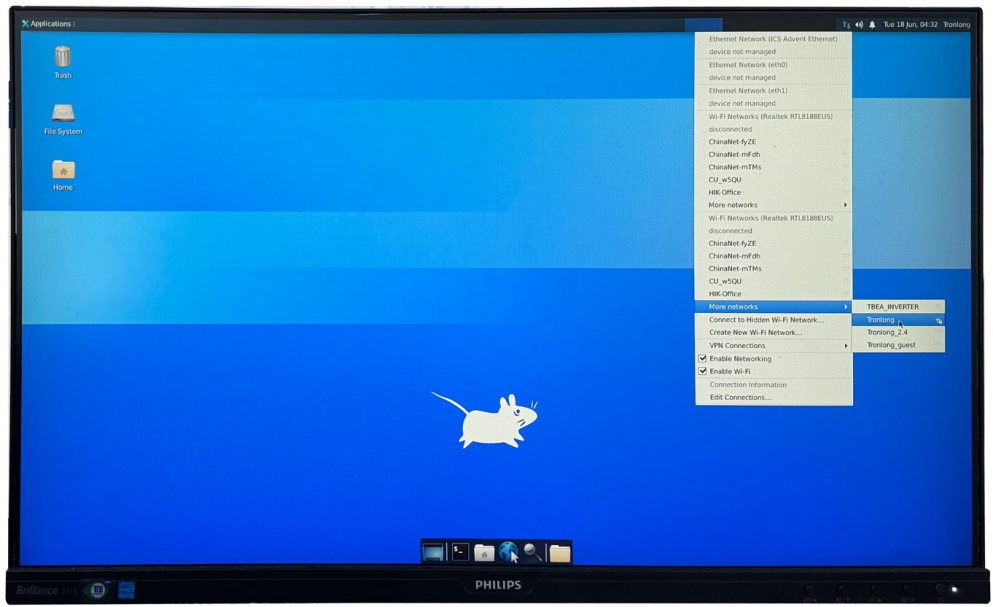

## 2.调试串口

调试接口如图。可通过该端口进入设备系统。

## 2. SIM卡插槽

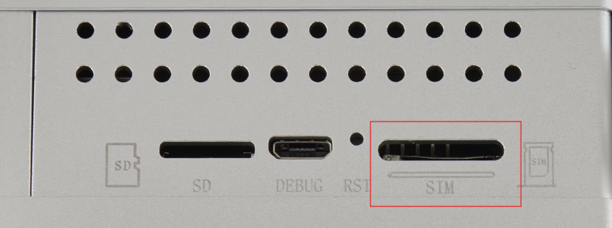

SIM卡槽如图所示。

### 2.1SD卡插槽

SD卡槽如图所示，支持FAT32格式SD卡，以sd卡烧录为例。

接入SD卡，属于系统启动卡，工作状态下，输入

fdisk -l

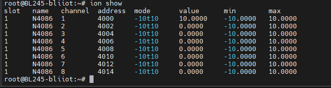

系统识别到存储介质包含两个有效大分区，后续读写性能测试将限定在SD卡路径下进行”，并且可直观读取到该存储设备的实际物理容量。

可以通过指令查看k1p8分区能不能读写

blkid /dev/mmcblk1p8

识别到为用户分区，可读写即可使用

执行卸载指令

umount /dev/mmcblk1p8

然后输入以下指令测试写入：

fio --filename=/dev/mmcblk1p8 --ioengine=psync --rw=write --bs=1024k --size=1G --numjobs=1 --thread --group_reporting --name=write_job --ramp_time=1 --direct=1

可以看到工作状态下的（负载）写入的速度。

读取前需清除写入带来的缓存。

sync; echo 3 | tee /proc/sys/vm/drop_caches

再输入以下指令测试读取：

fio --filename=/dev/mmcblk1p8 --ioengine=psync --rw=read --bs=1024k --size=1G --numjobs=1 --thread --group_reporting --name=read_job --ramp_time=1 --direct=1

可以看到工作状态下读取的速度。

A~F步骤都正常说明这个SD卡接口没有问题。

测试完同步数据，重新测试需要清除缓存

sync; echo 3 | tee /proc/sys/vm/drop_caches

### 2.1重启按钮

重启按钮如图所示。按下松开后设备重启。

### 2.1 PCIE接口

PCIE接口支持4G和Wi-Fi功能。

#### 2.1.1 4G模块

此处使用移远EC200模块为例（AT命令端口为/dev/ttyUSB1），测试程序位于/usr/demo/4G目录下。插入电话卡，连接好天线。

（1）网络功能

ls /dev 看有没有ttyUSB开头的设备，没有就是没识别到模块

stty -F /dev/ttyUSB1 ispeed 115200 ospeed 115200 cs8 raw -echo //设置串口

查信号 20以上 ：

cat /dev/ttyUSB1 & echo -e "AT+CSQ\r" > /dev/ttyUSB1（输入1/2遍）

查是4G模块否能正常和SIM卡通讯：

echo -e "AT+CPIN?\r" > /dev/ttyUSB1

EC200还需加一条拨号指令

echo -e "AT+QNETDEVCTL=3,1,1\r" > /dev/ttyUSB1

查是否连接运营商，

echo -e "AT+COPS?\r" > /dev/ttyUSB1

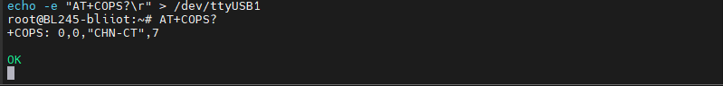

然后输入

udhcpc -i usb0

此时usb0应获取IP。

udhcpc: started, v1.30.1

udhcpc: sending discover

udhcpc: sending discover

udhcpc: sending select for 192.168.43.100

udhcpc: lease of 192.168.43.100 obtained, lease time 86400

然后通过ping www.baidu.com /8.8.8.8-I usb0 测试上网。

Ping不通百度加以下指令

echo "nameserver 8.8.8.8" > /etc/resolv.conf

（2）短信功能

在测试程序目录下执行测试命令即可测试短信功能：

./send_sms <device> <phonenumber> <text>

命令说明：<device>为4G模块设备节点。<phonenumber>为发送短信目标手机号。<text>为短信发送内容，短信内容字符之间不可有空格，否则会提示错误。

例如：./send_sms /dev/ttyUSB1 152******** “test”

此时对应号码应收到内容为“test”的短信。

（3）通话功能

在测试程序目录下执行测试命令即可测试拨号功能：

./phone_call <device> <phonenumber>

命令说明：<device>为4G模块设备节点。<phonenumber>为拨打目标手机号。

例如：./phone_call /dev/ttyUSB1 152********

此时对应号码应收到设备来电。

（4）GPS功能

在测试程序目录下执行测试命令即可测试GPS功能：

./get_location <device> <timeout>

命令说明：<device>为设备节点，以"ls /dev/ttyUSB*"命令查看结果为准，重启设备后可能会变化。<timeout>为等待返回经纬度信息的时间（单位为秒）。

例如：./get_location /dev/ttyUSB1 1

获取经纬度需等待几分钟时间，若获取失败、超时，请检查天线是否接好，并确保处于开阔场地进行测试。

#### 2.1.2 Wi-Fi模块

此处使用的Wi-Fi模块为BL-R8188EU2（2.4G频段）。测试程序及驱动位于/usr/demo/Wi-Fi路径下，连接好天线。若无wlan0网卡，可按下方步骤安装驱动。

（1）STA功能

先查看该版本系统是否已自动加载Wi-Fi驱动：

lsmod

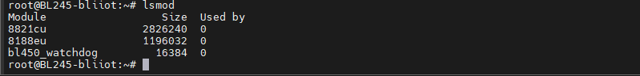

进入测试程序目录下，关闭其他网络，仅保留Wi-Fi网络，加载Wi-Fi驱动。

cd /usr/demo/wifi/ # 进入驱动目录

ifconfig eth1 down

ifconfig eth2 down

ifconfig eth3 down //关闭其他网络

insmod -f 8188eu.ko //加载Wi-Fi驱动，有就跳过

连接Wi-Fi：

ifconfig wlan0 up #打开wlan0

./wifi_setup.sh -i bliiot -p bebetter #连接Wi-Fi，-i后面接Wi-Fi名，-p后面接密码

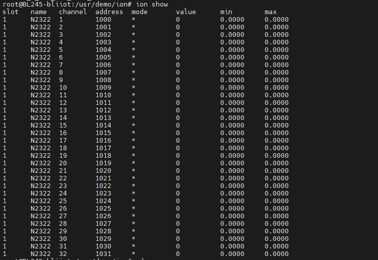

ifconfig #查看wlan0有无IP

最后ping百度测试：

ping -4 www.baidu.com （百度域名不一定成功转IP，使用百度IP）

（2）AP功能

重启系统后，进入测试程序所在目录，关闭其他网络，仅保留Wi-Fi网络，加载Wi-Fi驱动。

ifconfig eth1 down

ifconfig eth2 down

ifconfig eth3 down //关闭其他网络

insmod -f 8188eu.ko //加载Wi-Fi驱动，有就跳过

执行如下命令，将Wi-Fi模块设置为AP模式。

./ap_setup.sh

默认设置的Wi-Fi名称为：rtl8188eu，密码为：88888888，可在rtl_hostapd_2G.conf配置文件内进行修改。

nano rtl_hostapd_2G.conf

配置文件如果没有添加下列指令

interface=wlan0

driver=nl80211

ssid=rtl8188eu

channel=6

hw_mode=g

auth_algs=1

wpa=2

wpa_passphrase=88888888

wpa_key_mgmt=WPA-PSK

rsn_pairwise=CCMP

修改AP参数

nano ap_setup.sh

找到对应指令，输入指令修改

udhcpd -f -I 192.168.0.1 ./udhcpd.conf &

打开分配脚本

nano udhcpd.conf

没有则添加以下指令

start 192.168.0.100

end 192.168.0.200

interface wlan0

max_leases 10

option subnet 255.255.255.0

option router 192.168.0.1

option dns 8.8.8.8

然后在执行AP模式指令

./ap_setup.sh

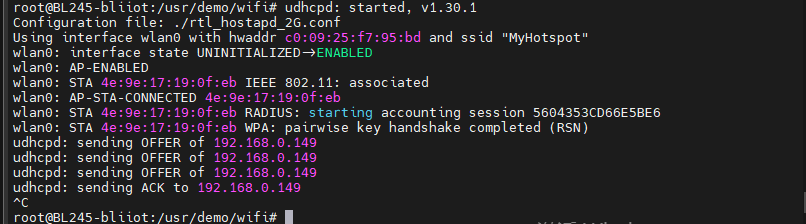

重新测试杀掉旧进程即可

killall -9 hostapd

killall -9 udhcpd

重新运行脚本

./ap_setup.sh

### 2.1 M.2接口

#### 2.1.1 SSD卡

M.2接口插入固态硬盘，查看是否能检测出固态硬盘，输入以下指令，在返回列表中，查找名为 nvme0n1 的设备及其容量大小。

lsblk -l

测试前需要保证固态硬盘不是已经挂载的状态，为保证固态硬盘没有被挂载，所以执行卸载指令：

umount /run/media/nvme0n1 //已卸载则跳过

写入测试数据：

fio -filename=/dev/nvme0n1 -ioengine=psync -iodepth=1 -iodepth_batch=1 -iodepth_low=1 -iodepth_batch_complete=1 -direct=1 -rw=write -bs=1024K -size=1G -numjobs=1 -thread -group_reporting -name=write_job -ramp_time=1

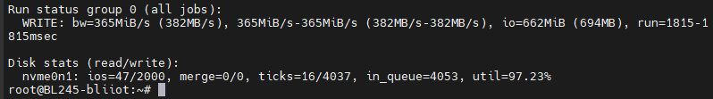

观察输出结果中的 WRITE 行，查看带宽（bw）数值，通常 NVMe 固态硬盘写入速度应在 数百 MB/s 以上（具体取决于硬盘性能）。若无报错且有速度数据输出，说明写入功能正常。

读取测试：

fio -filename=/dev/nvme0n1 -ioengine=psync -iodepth=1 -iodepth_batch=1 -iodepth_low=1 -iodepth_batch_complete=1 -direct=1 -rw=read -bs=1024K -size=5G -numjobs=1 -thread -group_reporting -name=read_job -ramp_time=1

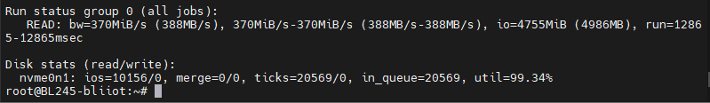

观察输出结果中的 READ 行，查看带宽（bw）数值。若无报错且有速度数据输出，说明读取功能正常。则硬盘本身功能正常。

### 2.1硬件看门狗

看门狗控制引脚：PE0，置1时关闭硬件看门狗。喂狗引脚：PG16。硬件看门狗超时时间为30ms。

### 2.1外部RTC

本设备含一个外部RTC时钟。

查看外部 RTC 设备节点：

root@BL245-bliiot:~# ls /dev/rtc*

/dev/rtc /dev/rtc0

root@BL245-bliiot:~# dmesg | grep rtc0

[ 4.319167] rtc-isl1208 5-006f: rtc core: registered rtc-isl1208 as rtc0

查看系统时钟：

root@BL245-bliiot:~# date

Thu 23 Apr 10:28:42 BST 2026

设置RTC时间：

root@BL245-bliiot:~# sudo hwclock --set --date="2026-4-23 17:30:00"

root@BL245-bliiot:~# sudo hwclock -r

同步RTC时钟至系统时钟：

root@BL245-bliiot:~# sudo hwclock -s

同步系统时钟到 RTC 的时钟：

root@BL245-bliiot:~# sudo hwclock -w

再次查看时间

root@BL245-bliiot:~# date

Thu 23 Apr 17:31:56 BST 2026

### 2.1加密芯片

加密芯片型号为RJGT102。基于SHA-256的加密认证算法, 同时提供可配置的看门狗定时器和对外复位功能，与MCU通过 I²C-5 串行接口通信，芯片

支持低功耗模式。

设备内使用加密芯片的demo，是通过将/proc/sys/kernel/random/uuid写入加密芯片，同时保留uuid至/usr/rjgt_unique.json，使用时取出加密芯片数据进行对比,外部数据与加密芯片内部数据相同，则通过加密验证。

使用请自行修改Makefile文件中交叉编译器路径，再make编译；或参考《RJGT102数据手册》。

运行示例程序rigt102，若uuid正确，则会出现如下回复。

root@BL245:~#usr/demo/other# ./rjgt102

open unique file failed, create unique file!

random uuid would write rjgt102 : b6275e22-4928-4828-88fb-54a6fd8!

Contrast success

root@BL245:~#usr/demo/other#./rjgt102

Contrast success

## 3.设备登录

### 3.1 USB登录

进入此电脑——管理——设备管理器，打开端口，插入USB线到micro USB，此时刷新的端口即为连接设备的端口。

此处以SecureCRT为例，在软件中新建连接，选择串口登录，选择对应的端口，波特率115200，数据位8，校验位None，停止位1。点击connect即可进入设备。

Linux系统默认无登录密码

Ubuntu系统默认登录账号：root 密码：root

### 3.2 SSH2登录

在使用网口登录前需设置对应网口的IP。此处以ETH2为例。此处ETH2已连接路由器，获取到的IP为192.168.2.107。电脑IP在2网段。

点击创建连接，选择协议为SSH2，主机名填写为设备IP：192.168.2.107，端口22，用户名root，点击Connect连接。

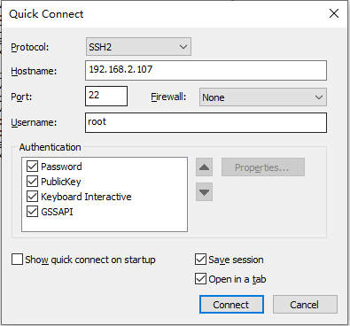

选择接受，即连接成功。

## 4.系统烧录

### 4.1 Micro SD卡启动

#### 4.1.1启动卡制作

由于BL245的镜像所需内存通常会大于4GB，所以在制作启动卡时需要将内存卡格式化为NTFS格式，并编辑“config.ini”文件。

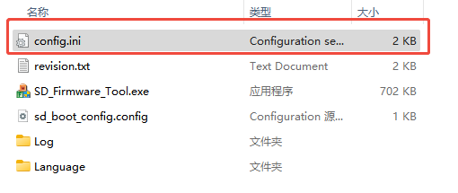

找到“System”项中添加“USER_DISK_FS=NTFS”内容，否则会导致烧录失败。

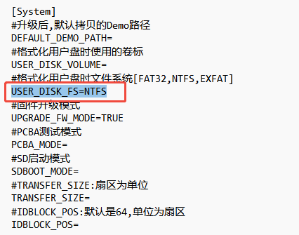

将空白Micro SD卡连接至电脑，打开“SDDiskTool_v1.69”文件夹，右键"SD_Firmware_Tool.exe"点击“以管理员身份运行(A)”。

在“第一步：选择可移动设备”中选择可移动磁盘设备，然后点击“恢复磁盘”进行格式化，如下图所示。

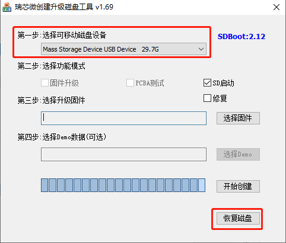

请确认所选的可移动磁盘设备无误，在弹出窗口中点击“是(Y)”进行格式化。

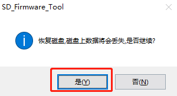

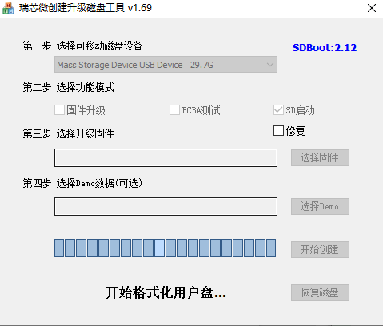

等待格式化完成后，在弹出窗口中点击“确定”。

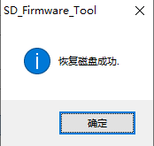

勾选“SD启动”选项，点击“选择固件”选择目标系统镜像文件，点击“开始创建”，在弹出窗口中点击“是(Y)”，制作SD启动卡。

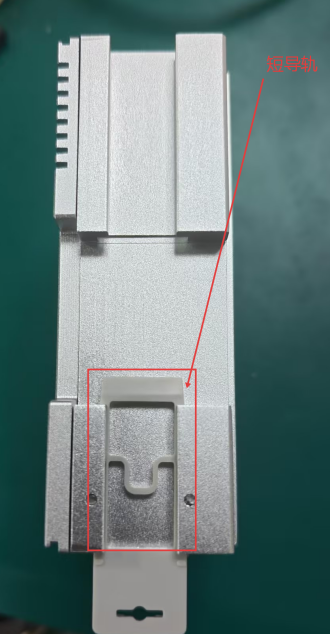

在弹出的窗口中点击“确定”，此时 SD 启动卡制作完成。

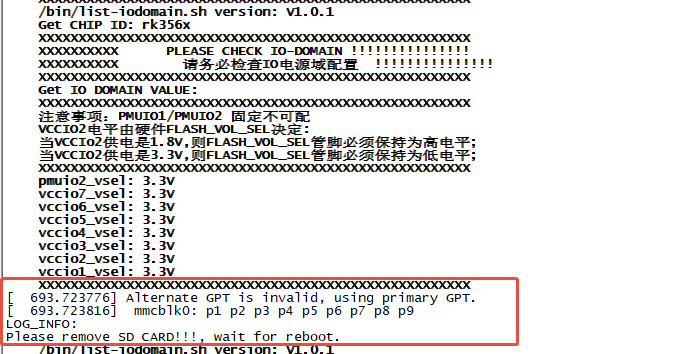

#### 4.1.2从启动卡启动

将启动卡插至设备Micro SD卡槽，然后将设备上电，系统将从启动卡启动后自动登录root用户，串口调试终端会打印如下类似启动信息。"Bootdev(atags): mmc 1"表示从Micro SD卡启动。

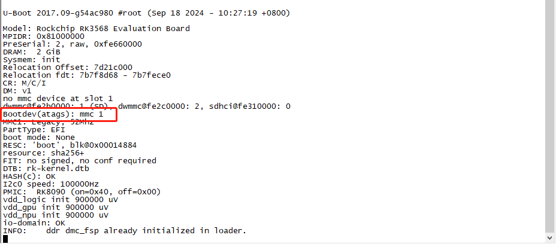

### 4.2 EMMC启动

#### 4.2.1烧录卡制作

将空白Micro SD卡连接至电脑，打开“SDDiskTool_v1.69”文件夹，右键"SD_Firmware_Tool.exe"点击“以管理员身份运行(A)”。

工具运行后会自动识别接入到PC端的Micro SD卡，如下图所示。

在“第一步：选择可移动设备”中选择可移动磁盘设备，然后点击“恢复磁盘”进行格式化，如下图所示。

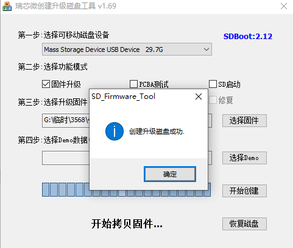

请确认所选的可移动磁盘设备无误，在弹出窗口中点击“是(Y)”进行格式化。

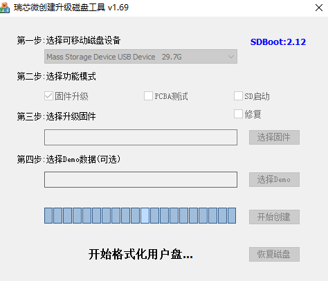

等待格式化完成后，在弹出窗口中点击“确定”。

勾选“固件升级”选项，点击“选择固件”选择目标系统镜像文件，点击“开始创建”，在弹出窗口中点击“是(Y)”，制作SD启动卡。

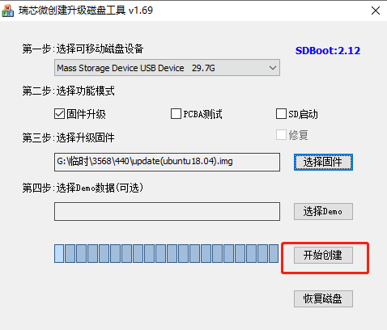

点击“是”。

开始烧写系统。

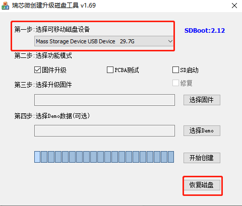

提示创建成功。

#### 4.2.2系统烧录

将制作好的SD卡插至设备Micro SD卡槽，上电后将从SD卡启动，并自动固化系统至eMMC中。等待约5分钟。当系统固化完成后，设备将自动掉电。串口打印如下。

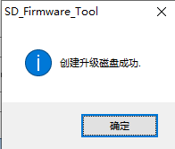

若为Ubuntu20.04系统则会弹出下图：

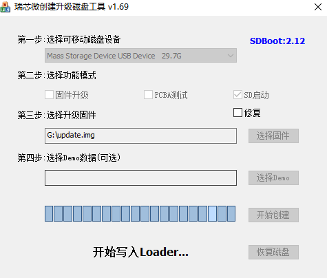

取出SD卡，波特率设置为115200，重新上电，设备将从eMMC启动系统，系统启动后自动登录root用户，串口调试终端会打印如下类似启动信息。"Bootdev(atags)：mmc 0"表示从eMMC启动。

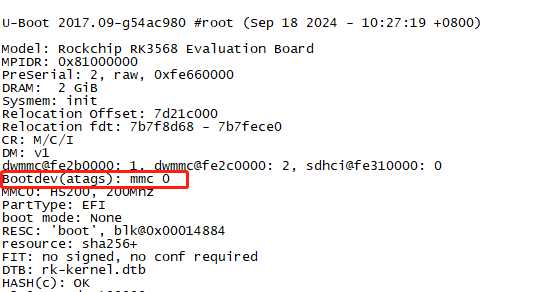

## 5.导轨安装

配备导轨卡扣分为。此设计预留了充足的螺丝锁付空间，便于用户进行安装操作。

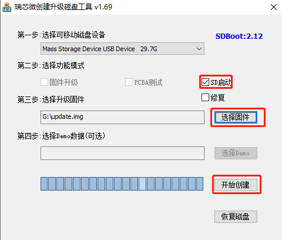
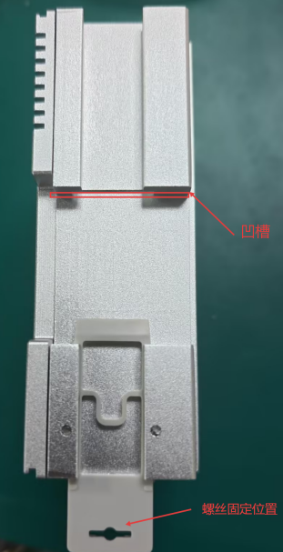

将卡扣垂直向下按压，直至其完全嵌入并锁定于导轨底部，即可完成安装。长导轨卡无需额外卡扣，因其内部已预设专用凹槽结构，可直接实现稳固连接。

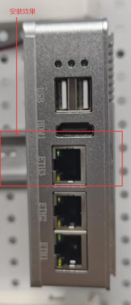

## 6.软件支持

OpenPLC

详细使用方法请参考《OpenPLC使用说明书》

Node-ed

详细使用方法请参考《Node-ed使用说明书》

QuickConfig

详细使用方法请参考《QuickConfig使用说明书》

BLRAT

详细使用方法请参考《BLRAT使用说明书》

EdgeCoder

详细使用方法请参考《EdgeCoder使用说明书》

## 7.电磁兼容性

| 测试类别 | 测试项目 | 测试标准 | 测试等级 | 测试条件 | 测试结果 | 备注 |
|---|---|---|---|---|---|---|
| 电磁发射 | 传导发射 | GB/T 9254 Class A/ CISPR 32 Class A | Class A | 150 kHz - 30 MHz | 合格 | 满足普通工业环境限值要求 |
| 电磁发射 | 辐射发射 | GB/T 9254 Class A/ CISPR 32 Class A | Class A | 30 MHz - 1 GHz | 合格 | 满足普通工业环境限值要求 |
| 抗扰度测试 | 静电放电（ESD） | GB/T 17626.2/IEC 61000-4-2 | III 级 | 接触放电 +/-4 kV 空气放电 +/-8 kV | 合格 | — |
| 抗扰度测试 | 射频辐射抗扰度 | GB/T 17626.3/ IEC 61000-4-3 | III 级 | 场强 10 V/m， 80 MHz - 1 GHz | 合格 | — |
| 抗扰度测试 | 电快速瞬变脉冲群（EFT） | GB/T 17626.4/ IEC 61000-4-4 | III 级 | 电源线 2 kV 信号线 1 kV | 合格 | — |
| 抗扰度测试 | 浪涌（Surge） | GB/T 17626.5/ IEC 61000-4-5 | III 级 | 差模 2 kV 共模 4 kV | 合格 | — |
| 抗扰度测试 | 电压暂降和中断 | GB/T 17626.11/ IEC 61000-4-11 | III 级 | 电压暂降70% 持续500ms， 完全中断10 ms | 合格 | — |
| 抗扰度测试 | 工频磁场抗扰度 | GB/T 17626.8/ IEC 61000-4-8 | III 级 | 测试强度30 A/m 工频50 Hz | 合格 | — |

注：如果电快速瞬变脉冲群（EFT）需要达到3级标准，需要单独购买我公司的滤波模块。

## 8.保修条款

## 1) 此设备从购买之日算起，为期一年内有任何材料或质量问题，免费维修。

## 2) 此一年保修不包括任何人为损坏、操作不当等造成的产品故障问题。

## 9.技术支持

深圳市钡铼技术有限公司

电话：0755-29451836

网址：http://www.bliiot.com
